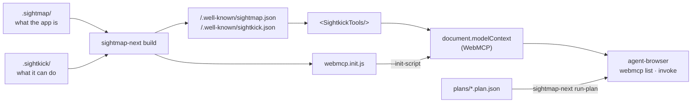
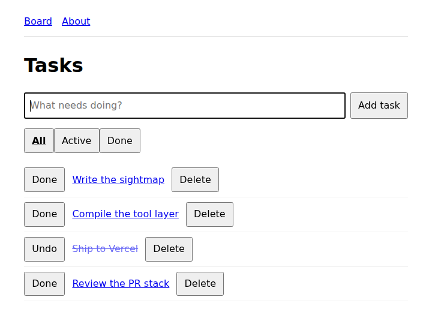
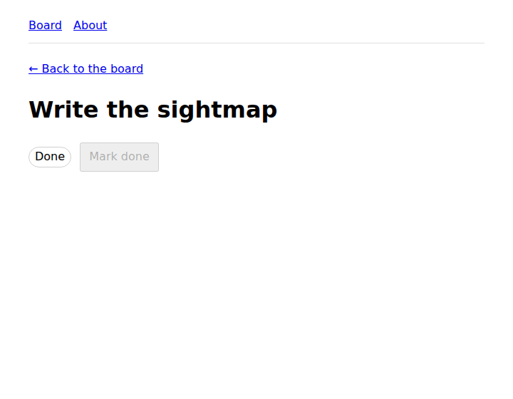

# sightmap-next

Next.js compatibility layer for [Sightmap](https://sightmap.org) and
[Sightkick](https://docs.sightmap.org/sightkick), with an integration for Vercel's
[agent-browser](https://github.com/vercel-labs/agent-browser). A Next.js app that carries a
`.sightmap/` corpus ships WebMCP tools on every deploy, with no change to application code,
and those tools are what agent-browser, the ChatGPT browser, and Chrome's native surface
call by name.



| Path | What |
|---|---|
| [`packages/next`](packages/next) | `@sightmap/next`: `sightmap-next seed` / `build` / `run-plan`, and `<SightkickTools/>` |
| [`examples/with-sightmap-webmcp`](examples/with-sightmap-webmcp) | A Next.js 16 task board with a corpus, nine tools, three Gherkin features, and stamped plans |
| [`docs/proposal.md`](docs/proposal.md) | The write-up: where this sits relative to `sitemap.ts`, what was verified, the PR sequence for the Vercel repos |

## Quick start

```bash
npm install
npx agent-browser install                      # Chrome for Testing 152, which has native WebMCP
npm run build:example && npm run start:example &
npx agent-browser open localhost:3000 && npx agent-browser webmcp list
npm run test:plans                              # replays the Gherkin scenarios, no model in the loop
```

 

## In your own app

```bash
npm i -D @sightmap/sightmap @sightmap/sightkick agent-browser && npm i @sightmap/next
npx sightmap-next seed          # .sightmap/ stubs from app/**/page.*, never overwrites
# curate against `next dev` with the sightmap-authoring skill; write .sightkick/tools.yaml
npx sightmap-next build         # public/.well-known/*, public/sightkick-runtime.js, webmcp.init.js
```

```tsx
// app/layout.tsx
import { SightkickTools } from "@sightmap/next";
import ir from "../public/.well-known/sightkick.json";
// …
<SightkickTools ir={ir} />
```

Requires Chrome 152+ for agent-browser to see the tools: it reads the browser's native
WebMCP registry over CDP, so a JavaScript polyfill is invisible to it.

## Contributing

`npm test` runs the package tests. Commits are signed off (`git commit -s`), as in the other
Sightmap repos. MIT, see [`LICENSE`](LICENSE).
