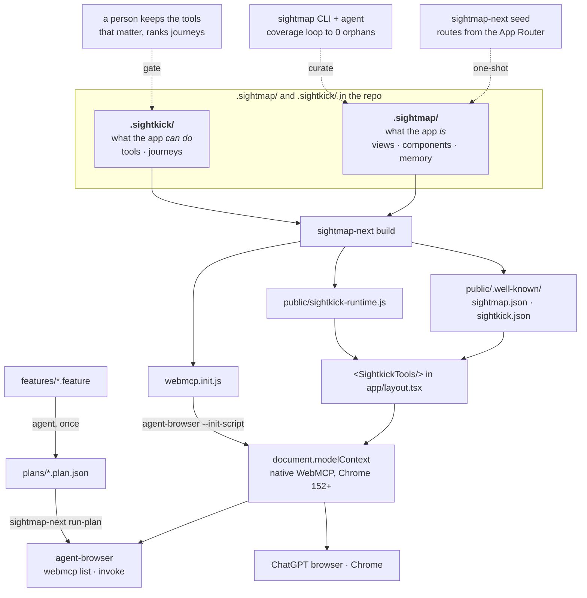

# Sightmap + Sightkick on Next.js and agent-browser: the proof of concept

A working proof of concept for how three things layer together on Vercel:

- **Sightmap** — a curated `.sightmap/` corpus that tells agents what a web app *is*
  (views, components, memory).
- **Sightkick** — a `.sightkick/` tool layer compiled against that corpus into
  [WebMCP](https://webmachinelearning.github.io/webmcp/) tools: what the app *can do*, by name.
- **agent-browser** ([vercel-labs/agent-browser](https://github.com/vercel-labs/agent-browser)) —
  Vercel's browser CLI for agents, which since 0.36.0 (2026-09-01) discovers and invokes
  WebMCP tools through Chrome's CDP `WebMCP` domain and ships a `webmcp-gen` skill for
  hand-writing them.

The claim this repo backs with evidence: **a Next.js app that carries a `.sightmap/`
corpus can ship WebMCP tools on every deploy without changing application code, and
those tools are exactly what agent-browser, ChatGPT's browser, and Chrome's native
surface consume — and what natural-language tests replay against.** Everything below
was run against Chrome for Testing 152 and agent-browser 0.36.0; the
transcript excerpts are real.

```
packages/next/                  @sightmap/next — the compatibility layer (zero runtime deps)
examples/with-sightmap-webmcp/  a Next.js 16 app with a corpus, a tool layer, features, and plans
```

## Where it sits relative to `sitemap.ts`

The `app/sitemap.ts` analogy is half right, and the half that is right matters.

**Right:** `sitemap.xml` is an app describing itself to a machine reader, served from a
well-known place, deployed with the app. A sightmap is the same thing for agents: routes
plus the interactive surface on each route plus the lore the source code does not record.
So the *served* half of this layer copies the sitemap shape exactly:

| Sitemap | Sightmap | Served at |
|---|---|---|
| `sitemap.xml` — what URLs exist | `sightmap.json` — what views, components, and memory exist | `/.well-known/sightmap.json` |
| — | `sightkick.json` — what named actions exist, with input schemas | `/.well-known/sightkick.json` |
| — | `sightkick-runtime.js` — registers those actions on `document.modelContext` | `/sightkick-runtime.js` |

**Wrong:** `sitemap.ts` is *code that derives* the document at build time. The spec's
[authoring conventions](https://github.com/sightmap/sightmap/blob/main/spec/v1/authoring-conventions.md) are explicit that
`.sightmap/` is a **curated authority**: no build-time generator, discovery against the
running app, agent proposes and a human reviews. A `sightmap.ts` that returned the corpus
from TypeScript would move the YAML into code and lose the curation loop. That is also
the answer to whether an `index.js`-style generator is the right shape: only the route
table is derivable. Selectors, properties, and memory come from the live loop.

So the layer splits three ways:

1. **Seed** (deterministic, one-shot): `sightmap-next seed` walks the App Router and
   writes one stub view per route — `route:`, `source:`, the layout chain as
   `dependencies:`, `stability: stub`. Route handlers under `app/api` become `requests:`
   seeds. It never overwrites a file. This is the part of the authoring skill's "seed
   from the codebase" step that a tool can do for you.
2. **Curate** (agentic): `next dev`, then the `sightmap-authoring` skill drives the
   coverage loop until zero orphaned nodes. A human reads the YAML diff.
3. **Publish** (build): `sightmap-next build` writes the three static files above plus
   `webmcp.init.js`, and `<SightkickTools/>` in the root layout boots the runtime on
   every page.

Zero Next.js changes are needed for any of this. The natural follow-on, once the shape has
been road-tested, is a real metadata file convention in Next.js —
`app/sightmap.yaml` served the way `app/robots.txt` is — which would make step 3's corpus
half disappear into the framework.

## The layering



The same picture as text:

```
 .sightmap/   what the app IS       seed: sightmap-next seed (routes) · curate: sightmap CLI + agent · gate: YAML review
 .sightkick/  what the app CAN DO   agent drafts one tool per real user action · gate: a human keeps the ones that matter
   journeys   what happens NEXT     from analytics / session replay / support · gate: a human ranks them
      │
      │  sightmap-next build   (sightmap export · sightkick build · sightkick runtime)
      ▼
 public/.well-known/sightmap.json   public/.well-known/sightkick.json   public/sightkick-runtime.js   webmcp.init.js
      │                                                                                                    │
      │  <SightkickTools/> in app/layout.tsx  (the app ships its own tools)                                │  agent-browser --init-script
      ▼                                                                                                    ▼
 document.modelContext — native WebMCP in Chrome for Testing 152+  ◄──  agent-browser webmcp list / invoke · ChatGPT browser · Chrome
      ▲
 features/*.feature  ──agent, once──▶  plans/*.plan.json  ──sightmap-next run-plan──▶  agent-browser, no LLM at replay
```

Two things worth noticing. The tool layer is view-scoped: on `/about` the page registers
nothing, and after a client-side `next/link` navigation back to `/` the board's tools
re-register without a reload. And agent-browser and the `sightmap` CLI can share one
Chrome: `agent-browser connect 7892` against a `sightmap browser start` session lists the
same tools, so an authoring agent and a testing agent see one page.

## What was verified

**1. agent-browser discovers Sightkick-compiled tools through native WebMCP.** The Sightkick
runtime registers on `document.modelContext`; on Chrome 152 that is the browser's own
surface, and agent-browser enumerates it over CDP, input schemas included.

```
$ agent-browser open localhost:3000 && agent-browser webmcp list
add_task [B8D45B9BD942E50CB09154540CAD22B9]
  Add a task to the board by title. Idempotent — an existing title is left alone. Returns `value` (string): The done state of the row just added ("false").
  http://localhost:3000
complete_task …  delete_task …  list_tasks …  open_task …  set_filter …

$ agent-browser open localhost:3000/about && agent-browser webmcp list
No WebMCP tools registered on the current page          # correct: no tools are declared for that view
```

**2. Invoking a tool drives the real UI and returns structured JSON with journey guidance.**

```
$ agent-browser webmcp invoke add_todo --params '{"text":"Ship the PoC"}'
{"content":[{"text":"{\"ok\":true,\"value\":\"Ship the PoC\",\"guidance\":[{\"tool\":\"list_todos\",\"reason\":\"see the todo you just added\",\"when\":\"now\"}]}","type":"text"}],"isError":false}
```

**3. Natural-language scenarios replay with no model in the loop.** Each Gherkin line was
resolved once (by an agent) to a tool call and an expectation; replay is a sequence of
`agent-browser webmcp invoke` calls. The plan refuses to run if the feature text or the
compiled tool layer changed since it was stamped.

```
$ npm run test:plans
A new task appears on the board, not yet done
  ✓ When I add a task "Ship the proof of concept"
  ✓ Then the board lists "Ship the proof of concept" / And it is not done
Complete a task from its detail page
  ✓ When I open "Write the sightmap"
  ✓ Then the task page shows it as "Active"
  ✓ When I mark it done
  ✓ Then the task page shows it as "Done"
  ✓ When I go back to the board
  ✓ And I show only Done tasks / Then "Write the sightmap" is listed as done
Only done tasks under the Done filter
  ✓ When I show only Done tasks / Then "Ship to Vercel" is listed / And "Write the sightmap" is not listed
  ✓ When I show only Active tasks / Then "Write the sightmap" is listed / And "Ship to Vercel" is not listed

$ echo "# edited" >> features/filter.feature && sightmap-next run-plan plans/filter.plan.json
✗ features/filter.feature changed since this plan was stamped — re-plan it (or pass --stale-ok)
```

**4. The same artifact works as an agent-browser init script**, for a preview deployment
that does not ship the component yet, or for a site you do not own. When both are
present the boot script detects the injected runtime and registers nothing twice.

```
$ sightmap-next run-plan plans/triage.plan.json --init-script ./webmcp.init.js      # all six steps ✓
$ agent-browser eval '…'  → {"mode":"direct","polyfilled":false,"registered":6,"bootedFromInitScript":true}
```

**5. The authoring loop closes on Next.js.** Seeded stubs, curated against `next start`
with the `sightmap` CLI on the same Chrome 152 build, reach 100% direct coverage; the one
orphan was Next's `#__next-route-announcer__`, now a shared component.

```
$ sightmap snapshot --coverage --url http://localhost:3000/
20 interactive · 20 direct T1 (100%) · 0 scoped T2 (0%) · 0 orphaned T3 ✓
$ sightmap browser mcp list
WebMCP (native) — 6 tool(s): …                            # sightmap's own view of the same surface
```

## Where the humans are

Sightmap authoring is nearly autonomous: seed, loop to zero orphans, read the YAML diff.
Sightkick needs two decisions a corpus cannot make:

- **Which actions become tools.** An agent can draft a candidate tool for every interactive
  cluster in a view; the person who owns the product deletes the ones that do not matter.
  In the example, `delete_task` and `set_filter` are tools; "toggle the theme" would not be.
- **Which journeys matter.** Journeys compile into the `guidance` breadcrumbs on each result.
  They should come from how the app is actually used: Vercel Web Analytics events, Subtext
  session replays, the support queue. Sightkick's own notes describe mining them from
  sessions as future work; until then a human ranks them.

Both live in `.sightkick/*.yaml`, which is small, reviewable, and refused by the compiler
the moment it references a name the corpus no longer has.

## Can the corpus itself enrich agent-browser?

Partly, and the part that cannot is the part Sightkick already covers.

agent-browser's plugin protocol (`agent-browser.plugin.v1`, stdio JSON) declares four
capabilities: `credential.read`, `browser.provider`, `launch.mutate`, and `command.run`.
None of them touches `snapshot` output, so a plugin cannot rewrite the accessibility tree
to read `[TaskRow title="…"]` the way `sightmap snapshot` does. That annotation would be an
upstream change to `snapshot` itself (a `--sightmap` flag that maps nodes to components),
and it is the one item below that needs Vercel's code.

What a plugin *can* do is worth building:

| Capability | An `agent-browser-plugin-sightmap` would… | Verified here? |
|---|---|---|
| `launch.mutate` | When the working directory has `.sightmap/` + `.sightkick/`, append `webmcp.init.js` as an init script and the WebMCP launch flags. Tools appear on any site the corpus describes, with no `--init-script` on the command line. | The same effect via `--init-script`, yes |
| `command.run` | Expose `sightmap snapshot`, `explain`, `coverage` as `agent-browser plugin run sightmap sightmap.snapshot`, and through the MCP `debug` profile's `command.run` tool, so a coding agent gets the annotated tree without a second CLI. | Attach path, yes: `agent-browser connect 7892` on a `sightmap browser start` session |
| skills | A `sightmap` skill served by `agent-browser skills get` that tells the agent to read `.sightmap/` memory before driving, and to prefer `webmcp invoke` over clicks when tools exist. | n/a, docs |

The short version: with Sightkick and WebMCP in the middle, most of the enrichment value
arrives as *tools* (structured `returns` instead of a tree walk) and as *guidance* on each
result, both of which agent-browser consumes today unchanged. The plugin is the
convenience layer on top; the `snapshot` annotation is the only thing that needs a PR into
agent-browser, and it can wait until the tool path has been road-tested.

## Why this is interesting for Vercel

- **WebMCP-ready deploys with no app changes.** OpenAI enabled WebMCP in the ChatGPT
  desktop browser on 2026-08-25 with Vercel as a launch partner, and Chrome's native
  surface is shipping. Almost no production app declares tools yet. Compiling them from a
  corpus turns "add WebMCP" from a feature project into a build step, and keeps the
  declared tools honest against the live DOM.
- **agent-browser's `webmcp-gen` gets a source of truth.** The skill's artifact set —
  `manifest.json`, `webmcp.init.js`, `eval.json`, `eval-report.md` — maps one to one onto
  `.sightkick/`, `sightmap-next build`, `plans/*.plan.json`, and `run-plan` output. Where a
  repo has a corpus, the skill can compile instead of hand-writing selectors.
- **Tests written in plain language that survive redesigns.** A selector change is one
  line in the corpus; every tool and every plan keeps working. The plan hash tells you
  when to re-plan, and nothing else can fail a run except a real expectation.
- **Shared memory for every agent that touches the app**: the coding agent in the repo,
  the browser agent on the preview, the runtime agent in a customer's browser all read the
  same `.sightmap/`.

## Proposed PRs, smallest first

1. **vercel-labs/agent-browser — docs + skill addendum.** A short section in the WebMCP docs
   and in `webmcp-gen`: "if the repo has `.sightmap/`, compile the tools with Sightkick and
   load `webmcp.init.js` with `--init-script`". No code. Establishes the vocabulary.
2. **vercel/next.js — `examples/with-sightmap-webmcp`.** The `example/` directory here,
   trimmed to the `with-*` conventions. Shows the whole loop on the stock App Router.
3. **vercel/next.js — RFC discussion for a `sightmap` metadata file convention.**
   `app/sightmap.yaml` → `/.well-known/sightmap.json`, mirroring `robots.txt`, with a
   `webmcp` companion for the compiled tool layer. Only after 1 and 2 have landed.
4. **sightmap/sightmap-next — this repo.** Done; review here first.
5. **sightmap/sightkick — two small follow-ups surfaced here**: `sightkick build
   --format init-script` (what `sightmap-next build` concatenates by hand today), and a
   `--via agent-browser` executor for `sightkick call` / `run-plan`.

## Friction log

Things found on the way that a reviewer should know:

- **agent-browser's WebMCP is CDP-only.** It enumerates the browser's native tool registry
  (`WebMCP.enable`), so a JavaScript polyfill of `document.modelContext` is invisible to it.
  On Chromium 141 the command reports `webmcp_unsupported`; on Chrome for Testing 152 the
  Sightkick runtime registers natively and everything works. `agent-browser install` fetches
  152 today.
- **Same-named children under different parents collide at compile time.** `BackToBoardLink`
  existed under both `TaskDetail` and `TaskMissing`; the bare query resolved to the wrong
  one and the scoped query `TaskDetail BackToBoardLink` still compiled against the last
  definition. Renaming fixes it; worth a diagnostic in `sightkick build`.
- **`sightkick build --verify` warns `verify.no-rows` for `mark_done` on `TaskDetail`** even
  with a capture present and `read_task` (same view, same returns) passing. Not chased.
- **`sightmap capture --all` reported "cannot connect to Chrome at"** in a detached session
  while `capture --url` for each view worked. Not chased.
- **Inlining the IR at build time** (`import ir from "../public/.well-known/sightkick.json"`)
  means a stale `.next/` can serve an old tool layer; `sightmap-next build` is wired as
  `prebuild` for that reason. Fetching the IR at runtime (pass a URL to `<SightkickTools/>`)
  trades a round trip for never being stale.

## Try it

```bash
npm install && npx agent-browser install
cd examples/with-sightmap-webmcp         # Chrome for Testing 152
npm run build && npm run start &                 # prebuild runs sightmap-next build
npx agent-browser open localhost:3000 && npx agent-browser webmcp list
npm run test:plans
```

To re-curate: `npx sightmap browser start --detach --url http://localhost:3000/`, then
`npx sightmap snapshot --coverage --url http://localhost:3000/`, then edit `.sightmap/`.

Sources: [agent-browser changelog](https://agent-browser.dev/changelog) ·
[OpenAI WebMCP Challenge](https://openai.com/webmcp-challenge/) ·
[WebMCP draft, 2026-09-04](https://webmachinelearning.github.io/webmcp/) ·
[Next.js `sitemap.xml` convention](https://nextjs.org/docs/app/api-reference/file-conventions/metadata/sitemap) ·
[Sightkick scenario testing](https://github.com/sightmap/sightkick/blob/main/docs/scenario-testing.md)
