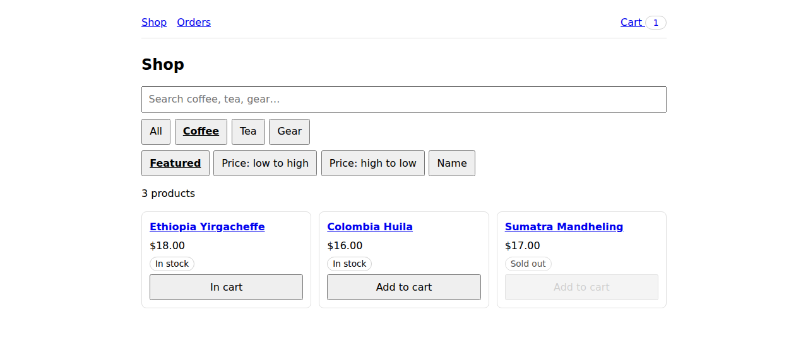
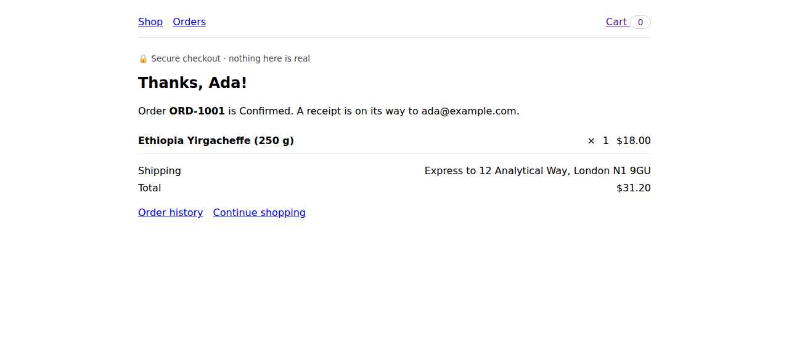

# with-sightmap-storefront

A Next.js 16 storefront — catalog with search, category filter, and sort; product pages with
sizes and quantities; a cart with coupons; a validated checkout; order confirmation and
history — whose `.sightmap/` corpus and `.sightkick/` tool layer compile into 34 WebMCP
tools across six views. It is the end-to-end test bed for `@sightmap/next`: the smaller
[`with-sightmap-webmcp`](../with-sightmap-webmcp) shows the shape, this one puts weight on it.

 

```
app/                 route groups (shop)/ and (checkout)/, a group layout, two route handlers
components/          one client island per view, data-component hooks throughout
lib/                 the catalog, the in-memory cart/order store, coupon rules
.sightmap/           the corpus: seeded by `sightmap-next seed`, curated to 100% direct coverage
.sightkick/          the tool layer: 34 tools in one file per view, five journeys
features/            six scenarios in plain Gherkin
plans/               each scenario resolved once to tool calls; stamped against the feature + IR
scripts/e2e.mjs      the end-to-end test of the adapter itself (see below)
public/.well-known/  generated by `sightmap-next build`: sightmap.json, sightkick.json
public/sightkick-runtime.js, webmcp.init.js    generated: the runtime, and runtime + IR for --init-script
```

## What is different from the task board

| | `with-sightmap-webmcp` | `with-sightmap-storefront` |
|---|---|---|
| Views / tools | 3 / 9 | 6 / 34 |
| Router features | flat `app/` | route groups, a group layout, `generateStaticParams`, dynamic routes, two route handlers |
| `<SightkickTools/>` | inlines the IR at build time | **fetch mode**: no `ir` prop, the runtime fetches `/.well-known/sightkick.json` after hydration |
| Async | none | coupon validation round-trips to `POST /api/coupons`; tools wait on the DOM it updates |
| Negative paths | — | a sold-out product, a rejected coupon, a failed `place_order` read back through `read_form_errors` |
| Returns | scalars and row lists | plus single-row lists for "read everything on this view" (`read_product`, `read_totals`, `read_order`) |

State is in-memory per tab on purpose: every fresh `open` starts with an empty cart and no
orders, so every replayed plan — and every `ORD-1001` expectation — starts from the same place.

## Run

```bash
npm install                          # at the repo root
npx agent-browser install            # Chrome for Testing 152, which has native WebMCP
npm run build                        # prebuild → sightmap-next build
npm run start
```

```bash
npx agent-browser open localhost:3000
npx agent-browser webmcp list                                   # the 7 catalog tools
npx agent-browser webmcp invoke search_products --params '{"query":"kettle"}'
npx agent-browser webmcp invoke open_product --params '{"name":"Pour-over kettle"}'
npx agent-browser webmcp list                                   # now the 6 product-page tools
npm run test:plans                   # replays features/ via plans/, no model in the loop
npm run test:e2e                     # the adapter end to end, plans included
```

## What `test:e2e` proves

`scripts/e2e.mjs` needs the app running (`SIGHTMAP_BASE_URL` overrides `http://localhost:3000`)
and checks, in order:

1. `sightmap-next build` wrote `/.well-known/sightmap.json`, `/.well-known/sightkick.json`,
   and `/sightkick-runtime.js`, and Next serves each byte-for-byte with the right content type;
   `webmcp.init.js` embeds the runtime and the IR.
2. The compiled IR agrees with the corpus: 6 views, 34 tools, every tool view-scoped, journeys
   compiled into guidance.
3. `<SightkickTools/>` in fetch mode boots the runtime on a hard load and registers on the
   browser's **native** `document.modelContext`, not the polyfill.
4. Exactly the expected tools register on each of the six routes, including `/orders/:id` for
   an order that does not exist in the tab.
5. Tools re-register on client-side navigation with no reload: `open_product` → product
   tools, `view_cart_from_product` → cart tools, and the cart line survives the trip.
6. Results carry journey guidance, including `after_navigation` guidance into the next view.
7. `webmcp.init.js` via `agent-browser --init-script` boots the same tools, and the page's own
   `<SightkickTools/>` reuses it instead of registering twice.
8. All six stored plans replay green (48 steps).

The same tools were also driven from the Sightmap side, on the same Chrome build:
`sightmap browser mcp list` reports `WebMCP (native) — 7 tool(s)` on the catalog,
`sightmap browser mcp call` and `sightkick call . <tool>` (both `--via webmcp` and `--via cli`)
return the same results, and `sightmap snapshot --coverage` reads `0 orphaned T3 ✓` at 100%
direct coverage on every view.

## Change something

- **UI changed?** `npx sightmap browser start --detach --url http://localhost:3000/`, then
  `npx sightmap snapshot --coverage --url http://localhost:3000/<view>` and edit `.sightmap/`
  until it reads `0 orphaned T3 ✓`. `npm run sightmap:validate` compiles the tool layer against
  the corpus and fails on any name it no longer has.
- **Want a new action?** Add a tool to the view's file in `.sightkick/`, rebuild, re-stamp the
  plans that changed: `npx sightmap-next run-plan plans/x.plan.json --stamp`.
- **New scenario?** Write the `.feature`, have an agent (or yourself) resolve it into a
  `plans/*.plan.json`, stamp it, add it to `test:plans` and to `PLANS` in `scripts/e2e.mjs`.
- **New route?** Add its tools to `EXPECTED` in `scripts/e2e.mjs`; the harness insists that map
  covers every compiled tool exactly once.
